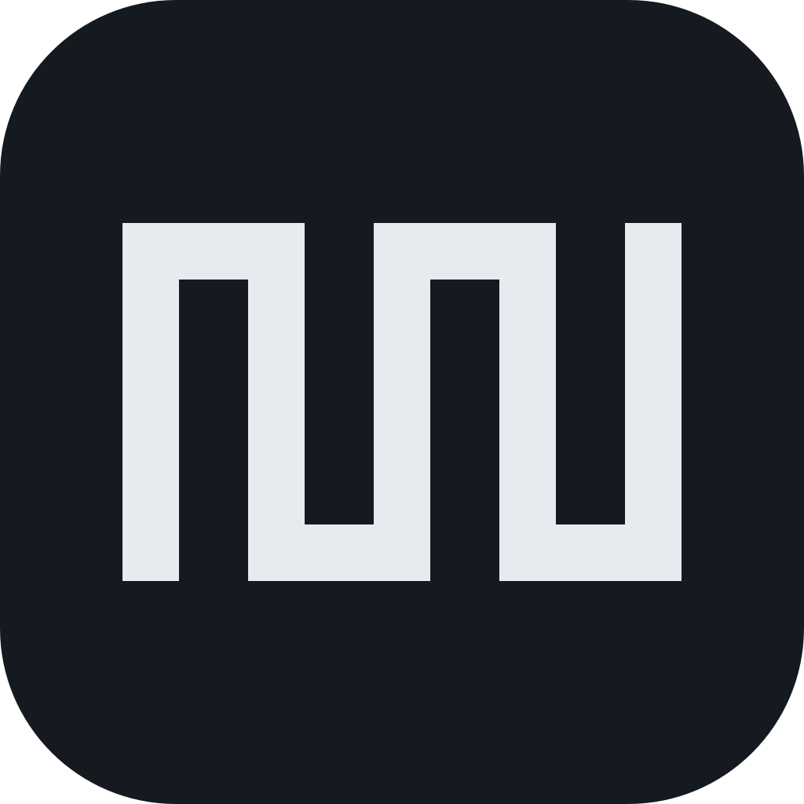

<a id="readme-top"></a>

[![CI][ci-shield]][ci-url]
[![Release][release-shield]][release-url]
[![Issues][issues-shield]][issues-url]
[![License][license-shield]][license-url]

<br />
<div align="center">
  <a href="https://github.com/dev1f965x/4ghz/releases/latest">
    
  </a>

<h3 align="center">4GHz</h3>

  <p align="center">
    An unofficial Windows app with schedules, redeem codes, and a chore calendar for Genshin Impact, Honkai: Star Rail, and Zenless Zone Zero.
    <br />
    English | <a href="README.ko.md">한국어</a>
    <br />
    <br />
    <a href="https://github.com/dev1f965x/4ghz/releases/latest"><strong>Download »</strong></a>
    <br />
    <br />
    <a href="https://github.com/dev1f965x/4ghz/issues/new?template=bug_report.yml">Report a bug</a>
    &middot;
    <a href="https://github.com/dev1f965x/4ghz/issues/new?template=feature_request.yml">Request a feature</a>
  </p>
</div>

<details>
  <summary>Table of Contents</summary>
  <ol>
    <li>
      <a href="#about-the-project">About The Project</a>
      <ul>
        <li><a href="#built-with">Built With</a></li>
      </ul>
    </li>
    <li>
      <a href="#getting-started">Getting Started</a>
      <ul>
        <li><a href="#prerequisites">Prerequisites</a></li>
        <li><a href="#installation">Installation</a></li>
        <li><a href="#verify-the-download">Verify the download</a></li>
        <li><a href="#uninstall">Uninstall</a></li>
      </ul>
    </li>
    <li><a href="#usage">Usage</a></li>
    <li><a href="#roadmap">Roadmap</a></li>
    <li><a href="#privacy">Privacy</a></li>
    <li><a href="#data-accuracy">Data accuracy</a></li>
    <li>
      <a href="#development">Development</a>
      <ul>
        <li><a href="#smoke-test">Smoke test</a></li>
        <li><a href="#release">Release</a></li>
      </ul>
    </li>
    <li><a href="#contributing">Contributing</a></li>
    <li><a href="#license">License</a></li>
    <li><a href="#contact">Contact</a></li>
    <li><a href="#acknowledgments">Acknowledgments</a></li>
  </ol>
</details>

## About The Project

An unofficial Windows app with schedules, redeem codes, and a chore calendar for Genshin Impact, Honkai: Star Rail, and Zenless Zone Zero.

4GHz is not affiliated with or endorsed by the publishers or owners of these games. Genshin Impact, Honkai: Star Rail, and Zenless Zone Zero are trademarks of their respective owners.

Changes are listed in the [changelog](CHANGELOG.md).

<p align="right">(<a href="#readme-top">back to top</a>)</p>

### Built With

* [![Tauri][tauri-shield]][tauri-url]
* [![Rust][rust-shield]][rust-url]
* [![React][react-shield]][react-url]
* [![TypeScript][typescript-shield]][typescript-url]
* [![Tailwind CSS][tailwind-shield]][tailwind-url]

<p align="right">(<a href="#readme-top">back to top</a>)</p>

## Getting Started

### Prerequisites

Requires 64-bit Windows 11. Windows 10 is expected to work but is not tested.

### Installation

1. Download `4GHz_<version>_x64-setup.exe` from the [latest release](https://github.com/dev1f965x/4ghz/releases/latest).
2. Run it. It installs for your Windows account only and does not ask for administrator rights.
3. The installer is not code-signed, so Microsoft Defender SmartScreen may show "Windows protected your PC". Select **More info**, check that the app is `4GHz_<version>_x64-setup.exe`, then select **Run anyway**. Verify the download first (below) if you want to be sure it is the file built here.

4GHz checks for a new version when it starts and shows a notice in the app; it never updates itself. To update, install the new version over the old one. Your records are kept.

### Verify the download

Each release lists the installer's SHA-256 checksum in `<installer>.sha256`. In PowerShell, in the download folder:

```powershell
(Get-FileHash .\4GHz_<version>_x64-setup.exe -Algorithm SHA256).Hash
```

The result must match the checksum file (letter case aside).

The installer also has a build provenance attestation, signed when this repository's release workflow built it from the version tag. With the [GitHub CLI](https://cli.github.com/):

```powershell
gh attestation verify .\4GHz_<version>_x64-setup.exe --repo dev1f965x/4ghz `
  --signer-workflow dev1f965x/4ghz/.github/workflows/release.yml --source-ref refs/tags/v<version>
```

### Uninstall

Uninstall 4GHz in **Settings > Apps > Installed apps**. Your records stay in `%LOCALAPPDATA%\io.github.dev1f965x.4ghz` unless you choose to delete app data in the uninstaller.

<p align="right">(<a href="#readme-top">back to top</a>)</p>

## Usage

- **Schedule:** ongoing and upcoming events, endgame, and livestreams for each game, with a live countdown. Entries with an announcement open it in your browser.
- **Codes:** active redeem codes to copy, with a link to each game's redemption page. Mark codes you have redeemed.
- **Calendar:** a checklist of daily, weekly, and periodic chores that resets at your server's reset time, and a month view of the days you finished them.
- **Settings:** the games you play, your server for each game, which chores to track, the language (English or Korean), and whether countdowns show seconds.

<p align="right">(<a href="#readme-top">back to top</a>)</p>

## Roadmap

- [x] Schedule, codes, chore calendar, settings, a new-version notice, and offline use of downloaded data (0.1.0)

Feature requests go to [GitHub Issues](https://github.com/dev1f965x/4ghz/issues/new?template=feature_request.yml).

<p align="right">(<a href="#readme-top">back to top</a>)</p>

## Privacy

4GHz has no account and collects no personal data, usage data, or crash reports. It sends nothing about you anywhere.

- **Stored on your PC only:** your settings, checked chores, completed days, redeemed codes, and a copy of the downloaded data, in `%LOCALAPPDATA%\io.github.dev1f965x.4ghz`. Warnings and errors are logged to the `logs` folder there, at most three files of 1 MB.
- **Network requests:** the app downloads the schedule and code data from `dev1f965x.github.io` and checks `api.github.com` for a new release. These are plain downloads; like any web request, GitHub receives your IP address under [GitHub's privacy statement](https://docs.github.com/site-policy/privacy-policies/github-general-privacy-statement).
- **Links:** announcements, redemption pages, and release pages open in your browser, on the publishers' sites or GitHub.

<p align="right">(<a href="#readme-top">back to top</a>)</p>

## Data accuracy

Schedules and codes are collected by hand from official announcements and may be late or wrong. Times marked as estimated are guesses based on past patterns. Check the official announcement when a time matters.

<p align="right">(<a href="#readme-top">back to top</a>)</p>

## Development

The app is developed natively on Windows 11. Install these first:

- Visual Studio Build Tools with the “Desktop development with C++” workload
- Rust through rustup
- mise, which installs the Node.js, pnpm, cargo-deny, and cargo-about versions the repository pins
- Microsoft Edge (included with Windows 11), for the end-to-end tests

Run `mise install` once in the repository to get the pinned tools, then `pnpm install`.

<!-- This table is the only list of commands; AGENTS.md links here. -->

| Script | Purpose |
| --- | --- |
| `pnpm app:dev` | Run the app with hot reload |
| `pnpm app:build` | Build the release app and the per-user installer (`src-tauri/target/release/bundle/nsis`) |
| `pnpm check` | All checks: Biome, type check, knip, design tokens and color contrast, UI text, tests, license check, `pnpm audit`, rustfmt, Clippy, Rust tests, and cargo-deny |
| `pnpm test` | Unit tests (Vitest) |
| `pnpm test:e2e` | End-to-end and accessibility tests of the frontend in Microsoft Edge, with Tauri IPC and the network mocked (Playwright, axe-core) |
| `pnpm app:build:e2e` | Build the test copy of the app for the smoke test (see below) |
| `pnpm test:app` | Smoke test of the test copy; run `pnpm app:build:e2e` first |
| `pnpm license-check` | Check npm package licenses against the project's license policy |
| `pnpm notices` | Write the third-party notices to `public/third-party-notices.txt`; `pnpm app:build` runs it |
| `pnpm tokens` | Regenerate `src/tokens.css` and the `DESIGN.md` front matter after changing `design/visual/tokens.json` |
| `pnpm content-check` | Check UI text against the banned patterns in `CONTENT.md` |
| `pnpm format` | Format TypeScript, JSON, CSS, and Rust |
| `pnpm dev` | Run only the web frontend in a browser at http://localhost:1420 |
| `pnpm build` | Type check and build only the web frontend |
| `pnpm tauri <command>` | Run other Tauri CLI commands, for example `pnpm tauri icon design/icon/app-icon.svg` |

### Smoke test

`pnpm app:build:e2e` builds a copy of the app in `src-tauri/target/e2e` whose WebView2 opens a debugging port; it is never shipped. It has its own identifier, so its records stay apart from an installed copy. Its window settings repeat `tauri.conf.json` in `src-tauri/tauri.e2e.conf.json`, so change both together.

`pnpm test:app` drives that copy through msedgedriver: it checks a chore, restarts, and expects the check to remain, and reports the time until data is on screen. It deletes only the test copy's own `state.json`. `scripts/measure-memory.ps1` measures the copy's idle memory.

### Release

1. In a pull request, set the version in `package.json`, move the changes in `CHANGELOG.md` under a heading for that version with the release date, and update the comparison links at the end. Merge it.
2. Tag the merged commit on main and push the tag, for example `git tag v0.1.0 origin/main && git push origin v0.1.0`. The workflow stops if the tag does not match the version, is not on main, or already has a release. To redo a tag, delete it with `git push --delete origin v0.1.0` and `git tag -d v0.1.0`.
3. The Release workflow checks the build, attaches the installer, its checksum, and a build provenance attestation to a draft release, and uses the CHANGELOG section as the notes. Review the draft on GitHub and publish it.

<p align="right">(<a href="#readme-top">back to top</a>)</p>

## Contributing

Bug reports and feature requests go to [GitHub Issues](https://github.com/dev1f965x/4ghz/issues/new/choose), which has a template for each. Report security issues privately as described in [SECURITY.md](SECURITY.md).

<p align="right">(<a href="#readme-top">back to top</a>)</p>

## License

Distributed under the [MIT License](LICENSE). The app's About screen shows the third-party notices, which `pnpm app:build` generates into `public/third-party-notices.txt`.

<p align="right">(<a href="#readme-top">back to top</a>)</p>

## Contact

Project link: <https://github.com/dev1f965x/4ghz>

<p align="right">(<a href="#readme-top">back to top</a>)</p>

## Acknowledgments

* [Best-README-Template](https://github.com/othneildrew/Best-README-Template), the layout of this README
* [shadcn/ui](https://ui.shadcn.com) and [Base UI](https://base-ui.com), the UI components
* [Lucide](https://lucide.dev), the icons
* [Pretendard](https://github.com/orioncactus/pretendard) and [JetBrains Mono](https://www.jetbrains.com/lp/mono/), the typefaces

<p align="right">(<a href="#readme-top">back to top</a>)</p>

[ci-shield]: https://img.shields.io/github/actions/workflow/status/dev1f965x/4ghz/ci.yml?branch=main&style=for-the-badge&label=CI
[ci-url]: https://github.com/dev1f965x/4ghz/actions/workflows/ci.yml
[release-shield]: https://img.shields.io/github/v/release/dev1f965x/4ghz?style=for-the-badge
[release-url]: https://github.com/dev1f965x/4ghz/releases
[issues-shield]: https://img.shields.io/github/issues/dev1f965x/4ghz?style=for-the-badge
[issues-url]: https://github.com/dev1f965x/4ghz/issues
[license-shield]: https://img.shields.io/github/license/dev1f965x/4ghz?style=for-the-badge
[license-url]: LICENSE
[tauri-shield]: https://img.shields.io/badge/Tauri_2-24C8D8?style=for-the-badge&logo=tauri&logoColor=white
[tauri-url]: https://tauri.app/
[rust-shield]: https://img.shields.io/badge/Rust-000000?style=for-the-badge&logo=rust&logoColor=white
[rust-url]: https://www.rust-lang.org/
[react-shield]: https://img.shields.io/badge/React-20232A?style=for-the-badge&logo=react&logoColor=61DAFB
[react-url]: https://react.dev/
[typescript-shield]: https://img.shields.io/badge/TypeScript-3178C6?style=for-the-badge&logo=typescript&logoColor=white
[typescript-url]: https://www.typescriptlang.org/
[tailwind-shield]: https://img.shields.io/badge/Tailwind_CSS-0F172A?style=for-the-badge&logo=tailwindcss&logoColor=38BDF8
[tailwind-url]: https://tailwindcss.com/
